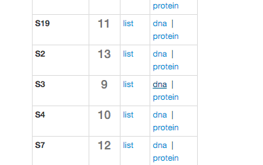

# Welcome to week 7 of metagenomics lab!

This week we're going to be going over some material that's very near and dear to my heart... phylogenetics!

A lot of microbial ecology research revolves around phylogenetic analysis, especially my own. So what is it, exactly?

Phylogenetics is basically the process by which we estimate relationships between organisms. In the case of today's lab, we'll be using it to measure the relationships between bacteria in your baby gut samples.

### What's required to perform phylogenetic analysis?
    - A sequence set (DNA or protein)
    - A multiple sequence alignment program
    - An alignment (made by using the two previously mentioned items)
    - Phylogenetic tree estimation software (FastTree, iQ-TREE, RAxML, etc)
    - Phylogenetic tree visualization software (iTOL, FigTree, etc)
    
### What software will we be using to get this info?
    - Sequence set: ggKbase
    - Multiple sequence alignment: Mafft and FAMSA (both on the cluster)
      - Mafft: https://mafft.cbrc.jp/alignment/software/
      - FAMSA: https://github.com/refresh-bio/FAMSA (Wicked fast!)
    - Alignment viewer: Aliview (https://ormbunkar.se/aliview/)
    - Tree building: FastTree (on cluster)
    - Tree visualization: iTOL (http://itol.embl.de)
    
---

# Section 1: Getting your sequences 

Log in to class.ggkbase.berkeley.edu on your browser, navigate to your baby's project page, and click "Genome Completeness -> Ribosomal Proteins" near the top of the page. You'll see a menu that looks like this:

