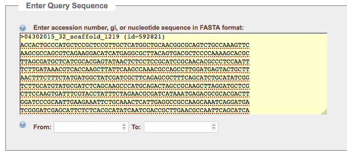

# Welcome to metagenomics data analysis lab week 8: Friday the 13th quarantine edition!

Hello everyone and welcome! This week's lab is going to be utilizing online resources, and will be structured a bit differently. Since we can't meet in person and we can't work in groups in the same way, you have the option of completing everything here now or spreading out your work during the week. Don't feel pressured, especially if you run into technical issues, to get this all done at once. 

And definitely don't stress if you encounter problems or obstacles. You can reach me on the slack workspace I created for the lab, which I sent out a link for on bCourses- I don't want to put that link on a publicly available webpage, so go ahead and go over there if you haven't already joined. That's the best way to get a quick response from me if you need my help.

This week's lab is going to be a demonstration/instruction of how to go about investigating interesting proteins you find in metagenomic data. Today we're going to focus exclusively on proteins you can find in your bins, since those are more interesting (you know, relatively, which organism they came from).

In our lab, we use several popular tools to look at interesting proteins, which each have their own advantages and disadvantages. Let's talk about them, and what they're each good at.

## Goals for today:

- Predict genes, ORFs using Prodigal
- Learn how to use BLASTp/BLASTn (your choice)
- Learn how to use Interpro and HMMscan
- Start playing with KEGG and investigating the metabolic pathways your proteins are part of

---

## Tools to investigate proteins of interest:

- Interproscan (most thorough)

<a href="https://www.ebi.ac.uk/interpro/search/sequence/">https://www.ebi.ac.uk/interpro/search/sequence/</a>

This option is the best if you have a protein that's really unusual and you want to find out exactly what it is. Interproscan uses a large suite of HMMs (probabilistic models that we won't go over in detail today) to give you a wealth of information about the protein sequence you provide. 

- Blastp (alignment-based)

<a href="https://blast.ncbi.nlm.nih.gov/Blast.cgi?PAGE=Proteins">https://blast.ncbi.nlm.nih.gov/Blast.cgi?PAGE=Proteins</a>

BLASTp draws on the strength of the NCBI's public sequence database, as well as a great list of structural models that help you see the domain-level features of your protein sequence, which can tell you a lot about its function.

- HMMscan (HMM-based, very fast)

<a href="https://www.ebi.ac.uk/Tools/hmmer/search/hmmscan">https://www.ebi.ac.uk/Tools/hmmer/search/hmmscan</a>

HMMscan allows you to search against a suite of domain-level HMMs, which can tell you a lot about what your protein does, and how it functions. Its companion program, pHMMer, gives you similar results along with a list of similar sequences from the EMBL-EBI's public database, although this approach yields many fewer hits than running BLASTp and I would recommend using BLAST instead of pHMMer unless you're pressed for time. It's really fast, though, and if you're doing tons of these searches, as I often am in the course of my research, it can be a real time saver.

---

# Choosing a sequence to work with

Go ahead and go over to <a href="class.ggkbase.berkeley.edu">class.ggkbase.berkeley.edu</a> and log in. Select one of your organisms, and click on it to get a list of the scaffolds in that bin. Select a relatively large scaffold (more than ~10kbp) and click on it. A good way to do this is to sort the sequences by '# features' and find a scaffold with more than 10 genes.

Click on the link to this contig and download the DNA sequence for this contig.  Open the fasta file in a plain text editor; select all (cmd+a on Mac or ctrl+a on Windows?), and copy the sequence.  Go to NCBI ORF finder (<a href="https://www.ncbi.nlm.nih.gov/orffinder">https://www.ncbi.nlm.nih.gov/orffinder</a>) and paste the sequence into the Query box.

